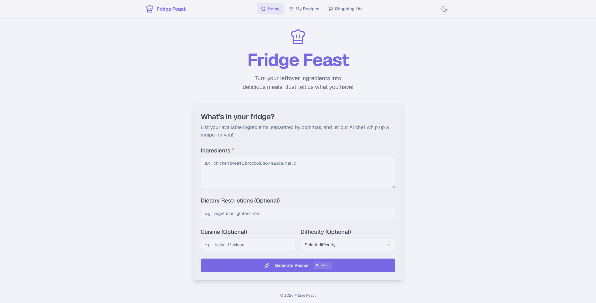
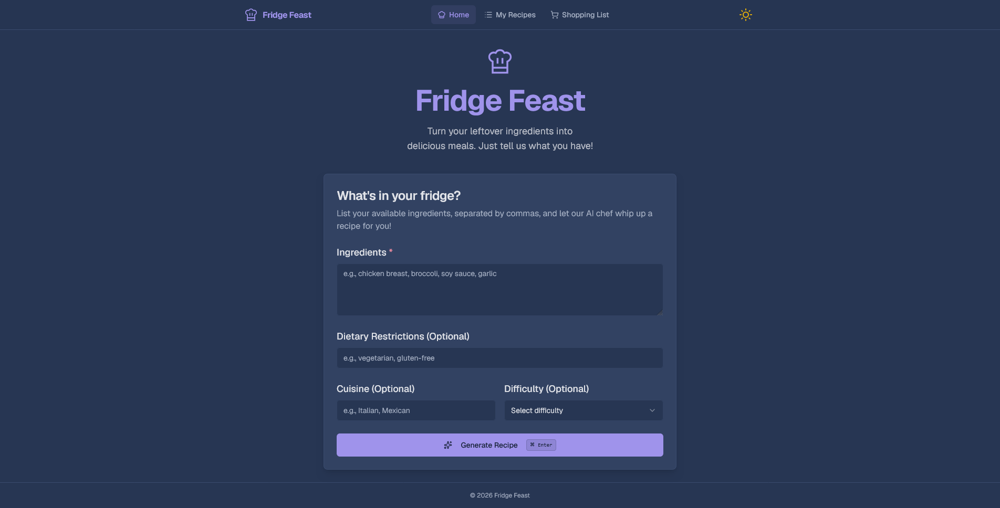
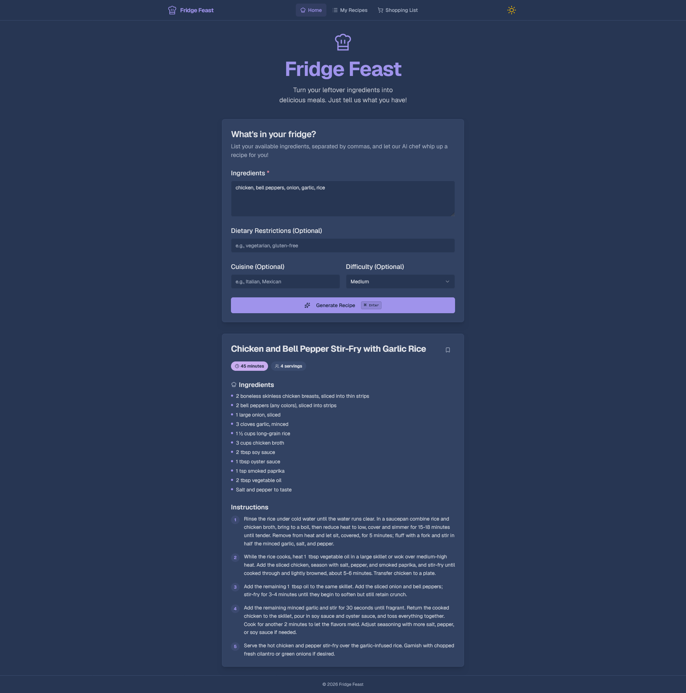

<p align="center">
  
</p>

<h1 align="center">Fridge Feast</h1>

<p align="center">
  Turn your leftover ingredients into delicious meals — just tell us what you have.
</p>

<p align="center">
  <a href="https://github.com/GaseousIce/Fridge-Feast/actions/workflows/check.yml">
    
  </a>
  <a href="/LICENSE">
    
  </a>
  <a href="https://nextjs.org">
    
  </a>
  <a href="https://bun.sh">
    
  </a>
  <a href="https://www.typescriptlang.org">
    
  </a>
  <a href="https://github.com/GaseousIce/Fridge-Feast/issues">
    
  </a>
</p>

---

## Screenshots

<table>
  <tr>
    <td width="50%">
      
    </td>
    <td width="50%">
      
    </td>
  </tr>
</table>

<p align="center">
  
</p>

## Features

- **AI Recipe Generation** — Get unique recipes tailored to your available ingredients
- **Ingredient Input** — List what you have in a simple textarea, add optional dietary restrictions, cuisine preference, and difficulty level
- **Catppuccin Theme** — Beautiful latte (light) and mocha (dark) themes with a smooth animated toggle
- **Recipe Storage** — Save generated recipes and auto-aggregate ingredients into a shopping list
- **Keyboard Shortcuts** — Press `Ctrl+Enter` / `Cmd+Enter` to generate a recipe instantly
- **Accessible** — ARIA-compliant with screen-reader-friendly live regions

## Getting Started

### Prerequisites

- [Bun](https://bun.sh) (package manager)

### Setup

```bash
# Clone the repository
git clone https://github.com/GaseousIce/Fridge-Feast.git
cd Fridge-Feast

# Install dependencies
bun install

# Set up environment variables
cp .env.example .env
# Then add your GROQ_API_KEY to .env

# Start the development server
bun run dev
```

The app runs on [http://localhost:9002](http://localhost:9002).

### Commands

| Command                | Description                                                |
| ---------------------- | ---------------------------------------------------------- |
| `bun run dev`          | Start dev server on port **9002** (with Turbopack)         |
| `bun run build`        | Production build (ESLint + `tsc --noEmit` + Next.js build) |
| `bun run start`        | Start production server                                    |
| `bun run lint`         | Run ESLint checks                                          |
| `bun run typecheck`    | Run TypeScript compilation check                           |
| `bun run test`         | Run Vitest unit tests                                      |
| `bun run format:check` | Verify code formatting with Prettier                       |
| `bun run format:write` | Auto-format all code files with Prettier                   |

## Project Structure

```
src/
├── ai/
│   └── flows/
│       └── generate-recipe.ts   # AI recipe generation (OpenAI SDK → Groq)
├── app/
│   ├── (app)/                    # Application routes
│   │   ├── recipes/
│   │   │   ├── [id]/              # Individual recipe view
│   │   │   └── page.tsx           # Saved recipes list
│   │   ├── shopping-list/        # Aggregated shopping list
│   │   ├── layout.tsx            # App shell layout
│   │   └── page.tsx              # Recipe generator home page
│   ├── favicon.ico
│   ├── globals.css               # Catppuccin theme variables
│   └── layout.tsx                # Root layout (theme + toast providers)
├── components/
│   ├── icons/
│   │   └── fridge-feast-logo.tsx # Brand logo component
│   ├── recipe/
│   │   ├── recipe-generator.tsx   # Main generator form
│   │   └── recipe-result-card.tsx # Generated recipe display
│   ├── animated-theme-toggle.tsx  # Circular-reveal theme toggle
│   ├── app-shell.tsx             # Navigation shell
│   └── ui/                       # shadcn/ui primitives (12)
├── hooks/
│   ├── use-recipe-storage.ts     # localStorage for recipes & shopping list
│   └── use-toast.ts              # Toast notification hook
└── lib/
    ├── types.ts                  # TypeScript definitions
    ├── utils.ts                  # Tailwind class merger (cn)
    └── utils.test.ts             # Utility tests
```

## Built With

- **Framework:** Next.js 16 (Turbopack)
- **Language:** TypeScript
- **Styling:** Tailwind CSS, shadcn/ui, Catppuccin theme (Latte & Mocha)
- **AI:** OpenAI SDK → Groq API (`openai/gpt-oss-120b`)
- **Forms:** react-hook-form, Zod validation
- **Icons:** Lucide React
- **Theming:** next-themes
- **Testing:** Vitest
- **Dev Tools:** ESLint, Prettier

## Testing

```bash
bun run test
```

Tests cover the `cn()` utility and the toast notification hooks.

## Feedback

Have feedback or suggestions? [Open an issue](https://github.com/GaseousIce/Fridge-Feast/issues) or start a [discussion](https://github.com/GaseousIce/Fridge-Feast/discussions) on GitHub.

## License

[MIT](/LICENSE)
